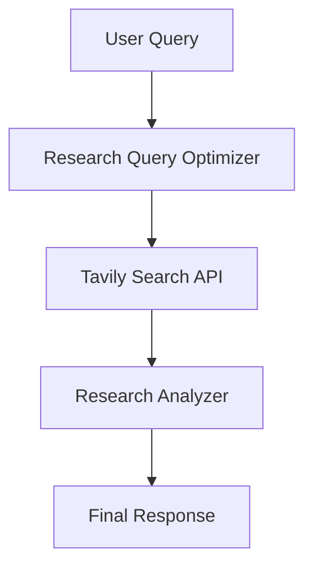

# 🔎 Agentic Research Assistant (LangGraph + Gemini + Tavily)

An intelligent research automation pipeline that transforms a user question into optimized research queries, retrieves high-quality web results, and synthesizes a structured, citation-backed answer.

This project demonstrates a modular **agentic workflow** built using LangGraph, Google Gemini, and Tavily Search.

---

## 🚀 Overview

This system performs research in three structured stages:

1. **Research Query Optimization**  
   Converts a user question into concise, high-signal search queries.

2. **Web Retrieval via Tavily**  
   Fetches relevant content and URLs from the web.

3. **Research Analysis & Synthesis**  
   Analyzes all retrieved sources and generates a detailed answer with citations.

The workflow is implemented as a **state-driven graph pipeline** using LangGraph.

---

## 🧠 Architecture



---

# 🛠 Tech Stack

## Core Technologies


---

## AI & Orchestration

- **Google Gemini (gemini-2.5-flash)** – Large Language Model for query optimization and synthesis  
- **LangChain** – LLM abstraction and prompt handling  
- **LangGraph** – Agentic workflow orchestration using state graphs  

---

## Retrieval Layer

- **Tavily Search API** – Search-augmented content retrieval  
- Built-in content extraction (no manual scraping layer)  

---

## Backend & Environment

- **Python 3.9+**
- **python-dotenv** – Environment variable management  
- **typing-extensions** – Typed state management  
- **getpass** – Secure API key input  

---

## 🏗️ Project Structure

```
agentic-research-assistant/
│
├── main.py
├── .env
├── requirements.txt
└── README.md
```

---

## 🔍 How It Works

### 1️⃣ Research Query Optimizer

- Takes user question
- Uses Gemini to generate optimized research queries
- Prevents redundancy
- Structures queries for high retrieval precision

### 2️⃣ Tavily Search API

- Executes optimized query
- Retrieves top 5 web results
- Returns:
  - URL
  - Extracted content
  - Metadata

> This is search-based retrieval, not manual web scraping.

### 3️⃣ Research Analyzer

- Combines all retrieved sources
- Synthesizes structured response
- Produces:
  - Detailed Answer
  - Summary
  - Inline citations with URLs

---

## 📦 Installation

### 1. Clone Repository

```bash
git clone https://github.com/yourusername/agentic-research-assistant.git
cd agentic-research-assistant
```

### 2. Create Virtual Environment

```bash
python -m venv venv
source venv/bin/activate
```

### 3. Install Dependencies

```bash
pip install -r requirements.txt
```

---

## 🔑 Environment Variables

Create a `.env` file:

```
GOOGLE_API_KEY=your_google_gemini_api_key
TAVILY_API_KEY=your_tavily_api_key
```

---

## ▶️ Usage

Run:

```bash
python main.py
```

You will be prompted:

```
Enter your Query:
```

The system will output:

- Detailed answer
- Summary
- Citations

---

## 🧩 Core Code Components

### State Definition

```python
class MessagesState(TypedDict):
    OptimizedQuery: str
    messages: list
    citations: list
    llm_calls: int
```

### LangGraph Workflow

```python
workflow.add_edge(START, "researchQueryOptimizer")
workflow.add_edge("researchQueryOptimizer", "searchAPI")
workflow.add_edge("searchAPI", "ResearchAnalyser")
workflow.add_edge("ResearchAnalyser", END)
```

---

## 🛠 Features

- Modular agentic workflow
- Deterministic LLM behavior (temperature=0)
- Search-augmented generation
- URL-based citation synthesis
- Clean separation of responsibilities
- Extendable architecture

---

## 🧱 Current Limitations

- Tavily handles content extraction (no custom scraping logic)
- No source ranking/scoring layer
- Single-pass synthesis (no iterative refinement)
- No streaming responses
- No citation deduplication logic

---

## 🔮 Future Improvements

- Multi-agent source evaluation
- Source credibility scoring
- Iterative retrieval refinement
- Memory-enabled research threads
- Parallel citation analysis
- Streaming output
- UI interface (Streamlit / React)

---

## ✨ Author

Built as an experimental research agent framework using modern LLM orchestration tools.